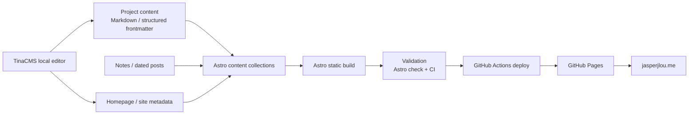

# Jasper Jiarui Lou — Personal Research & Engineering Portfolio

Source repository for **[jasperjlou.me](https://jasperjlou.me)**, my personal site for research interests, engineering projects, development notes, and selected technical writing.

The public-facing site is intentionally project-oriented: current project pages describe what is implemented now, while dated notes preserve earlier decisions and mistakes instead of silently rewriting project history.

## Site topology



## Current stack

- **Astro 7** for the static site and content collections;
- **TinaCMS** for local visual/content editing;
- **TypeScript** for site data and components;
- **GitHub Actions** for validation and deployment;
- **GitHub Pages** with the custom domain `jasperjlou.me`;
- Node.js **24+** as declared by the repository.

## Content structure

| Path | Purpose |
| --- | --- |
| `src/content/projects/` | Current project pages and verified project metadata |
| `source/_posts/` | Dated notes and historical development writing |
| `src/content/home/` | Homepage content |
| `src/pages/` | Astro page routes |
| `src/components/` | Reusable page/project components |
| `src/data/` | Site metadata and project grouping |
| `tina/` | TinaCMS collections and editing schema |
| `.github/workflows/` | CI and GitHub Pages deployment |

## Project presentation

The current portfolio covers:

- **CUHKSZ MicroWorld** — a Godot-based 3D campus Agent environment for semantic navigation, time-aware tasks, transport decisions, replanning, trajectory logging, and reproducible evaluation;
- **Holistic Assistant** — a curriculum-aware academic planning system built around official university documents, structured course data, editable roadmaps, and bounded AI assistance;
- **Market Watchdog** — a read-only market-intelligence and evidence-fusion system with deterministic safety gates and optional AI review;
- **AI Sync and Scheduled Tasks** — private infrastructure for portable AI development state, client-neutral shared contracts, and narrow scheduled workflows.

Project descriptions are periodically re-audited against the corresponding repositories. Historical blog posts may remain in their original language and should be read as snapshots of the project at the time they were written.

## Local development

```bash
npm ci
npm run dev
```

Run the site without the Tina editing layer:

```bash
npm run dev:site
```

Validate a production build:

```bash
npm run validate
```

## Branch and deployment model

The repository's default branch is `source`. Source content and site code are maintained there, while GitHub Actions builds and deploys the public site. Generated deployment output should not be edited as the source of truth.

## Identity

**Jasper Jiarui Lou**  
Computer Science · CUHK-Shenzhen  
Machine Learning · Optimization · Probability · Agent Systems

- Website: <https://jasperjlou.me>
- GitHub: <https://github.com/jasperjlou>
